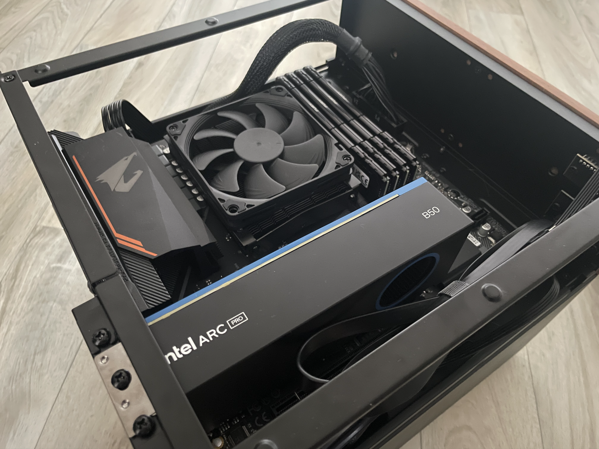

# Homeserver Ansible Setup

This Ansible project automates the installation, configuration, and management of a private home server running **Debian 13**.  
It provides a lightweight, secure setup for Docker containers and bare-metal services, including monitoring, SNMP integration, and automatic updates.

---

# Table of Contents

- [Goals](#goals)
- [Server Hardware & Environment](#server-hardware--environment)
  - [Hardware Specifications](#hardware-specifications)
  - [System Environment](#system-environment)
- [From Proxmox to Debian](#from-proxmox-to-debian)
- [Supported Services](#supported-services)
  - [Docker Containers](#docker-containers)
  - [Bare-Metal](#bare-metal)
- [Known Issues Related to Firewall Rules](#known-issues-related-to-firewall-rules)
- [Installation](#installation)
  - [Requirements](#requirements)
  - [Step 1: Clone the Repository](#step-1-clone-the-repository)
  - [Step 2: Setup Vault](#step-2-create-vault-file)
  - [Step 3: Edit all.yml](#step-3-edit-the-necessary-values-in-the-all.yml)
  - [Step 4: Create Inventory file](#step-4-create-inventory-file)
  - [Step 5: Add the User to sudo](#step-5-add-the-user-which-should-execute-the-playbook-to-sudo)
  - [Optional: Setup RAID 1 for storage](#optional-setup-raid-1-for-storage)
  - [Step 6: Enable or Disable Services](#step-6-enable-or-disable-services)
  - [Step 7: Execute the playbook](#step-7-execute-the-playbook)

---

## Goals

- Reduce unnecessary services and complexity  
- Unified deployment across new servers  
- Secure management of Docker containers, bare-metal services, and monitoring  
- Security-focused setup: minimal root usage, hardened SSH access  
- Easy re-deployment on new hardware or after reinstallation  

---

## Server Hardware & Environment

The home server has been upgraded to modern, efficient hardware to achieve a good balance of **performance, energy efficiency, and future readiness**.

<p align="center">
  
  <br>
  <sub><em>My Homeserver (December 2025)</em></sub>
</p>

### Hardware Specifications

| Component | Description |
|------------|-------------|
| **CPU** | AMD Ryzen 5 5600G – APU with integrated graphics and excellent energy efficiency |
| **RAM** | 128 GB DDR4 @ 3200 MT/s – originally for many VMs under Proxmox, now provides plenty of headroom for containers and caching |
| **System Drive** | 2 TB NVMe SSD – high I/O performance for system, Docker containers, and databases |
| **Data Storage** | 2 × 4 TB HDD – plenty of space for media, backups, and persistent data |
| **GPU** | Intel Arc Pro B50 with 16 GB VRAM – suitable for LLM workloads and Plex transcoding |
| **Mainboard** | Gigabyte B550M AORUS ELITE AX – stable, well-equipped, and future-proof |
| **Cooler** | NZXT low-profile CPU cooler – quiet and space-saving |
| **Case** | Jonsbo N4 NAS case – compact design with room for multiple 3.5" HDDs |

### System Environment

- **Operating System:** Debian 13 (Trixie)  
- **Management:** Fully automated via Ansible  
- **Services:** Mix of Docker containers and bare-metal applications  
- **Monitoring:** Checkmk with SNMP integration  
- **Network:** Static IP, 10 Gbit, SSH key access  

---

## From Proxmox to Debian

The server originally ran under **Proxmox VE** with multiple virtual machines.  
The move to **Debian 13** was made to simplify the setup and reduce resource usage.

**Reasons for the switch:**
- Eliminate unnecessary services and virtualization overhead  
- Direct hardware access without a VM layer  
- Less complexity for updates and backups  
- Potentially lower power consumption  
- Better integration with Ansible  

The new setup runs natively on Debian and uses Docker containers for modular services, resulting in a lightweight, consistent, and easy-to-maintain system.

---

## Supported Services

### Docker Containers

| Service | Description |
|----------|-------------|
| **Omada Controller** | Management of network devices (access points, switches, routers) |
| **Peanut** | Frontend for visualizing UPS data (via NUT server) and media status |
| **Nextcloud** | Private cloud for files, calendars, contacts, and backups |
| **Homepage** | Overview page for local services with icons and links |
| **Nginx Proxy Manager** | Reverse proxy with SSL certificate management |
| **Home Assistant** | Smart home automation and control |
| **Watchtower** | Automatic updates for all containers |
| **Pi-hole** | Network-wide DNS filter and ad blocker |
| **Checkmk** | Monitoring platform for hosts, containers, and services (including agent installation) |
| **Paperless** | Digital document management with OCR, tagging, and searchable archive |

### Bare-Metal

| Service | Description |
|----------|-------------|
| **Plex Media Server** | Local media server for movies, series, and music |
| **NUT Server** | Communication with UPS, providing status data via SNMP/Peanut |

---

## Known Issues Related to Firewall Rules

This section documents firewall rules that are currently required but **not yet fully automated via Ansible**.  
These rules may be integrated into a dedicated Ansible role in the future.

### Allow Nginx Proxy Manager to reach Nextcloud, this need to be done for every Service you want to reach through the Proxy-Manager:
```bash
ufw allow from 172.21.0.0/16 to any port 8080 proto tcp
```

### Allow external access for Nextcloud:
```bash
ufw allow 80/tcp
ufw allow 443/tcp
```

### Allow Peanut to reach NUT-Server:
```bash
ufw allow from 172.21.0.2/16 to any port 3493 proto tcp
```

---

## Installation

### Requirements

- Debian 13 with SSH access  
- User with `sudo` privileges  
- Ansible installed on the control machine  
- SSH key authentication configured
- ansible vault file

---


### Step 1: Clone the Repository

```bash
git clone <REPO_URL>
cd <REPO_NAME>
```

### Step 2: Create Vault file

Create a secret.yml (make sure to specify the path inside the playbooks):
```bash
mkdir vault
ansible-vault create vault/secret.yml
```

Note: The path for the secret.yml is defined inside the playbooks.

Example for a secret.yml:

> ⚠️ **Warning:** Make sure to change the passwords!

```bash
# ---------------------------------------------
# SSH-Key
# ---------------------------------------------
# Public SSH key for connecting to servers
vault_ssh_public_key: "<your ssh key>"

# ---------------------------------------------
# Nut-Server
# ---------------------------------------------
# Password for UPS configuration
vault_ups_password: "changeme"
# Password for the NUT user account
vault_nut_user_password: "changeme"

# ---------------------------------------------
# Nginx
# ---------------------------------------------
# Password for the Nginx Proxy Manager admin user
vault_npm_user_password: "changeme"

# ---------------------------------------------
# Nextcloud
# ---------------------------------------------
# Password for the MySQL root user
vault_mysql_root_password: "changeme"
# Password for the Nextcloud MySQL user
vault_mysql_nextcloud_password: "changeme"

# ---------------------------------------------
# Pihole
# ---------------------------------------------
# Password for the Pi-hole admin interface
vault_pihole_password: "changeme"

# ---------------------------------------------
# checkmk
# ---------------------------------------------
# Password for the Checkmk monitoring system
vault_checkmk_password: "changeme"

# ---------------------------------------------
# Paperless
# ---------------------------------------------
# Password for the Paperless database
vault_paperless_db_password: "changeme"
# Secret key for Paperless encryption and session management
vault_paperless_secret_key: "changeme"
```

### Step 3: Edit the necessary values in the all.yml 
Change the values for your services inside "group_vars/all.yml".

### Step 4: Create inventory file:
```bash
vim inventory.ini
```

Example for inventory.ini:
```bash
[debian_servers]
debian13 ansible_host=SERVER_IP ansible_user=USERNAME
```

### Step 5: Add the User which should execute the playbook to sudo

> ⚠️ **Security Note:**  
> Granting passwordless sudo is only required for the initial installation.  
> It is strongly recommended to remove this permission after the playbook has been executed successfully.

Add your user to the sudo group:
```bash
su -
sudo usermod -aG sudo <username>
```

Add the required permissions for the user:
```bash
sudo visudo
<username> ALL=(ALL) NOPASSWD:ALL
```

### Optional: Manual Setup of RAID 1 for Storage

> ⚠️ **Note:** This step is intentionally not automated via Ansible and is meant to be executed once during initial system setup.

```bash
# 1. Create GPT partition tables on both drives
parted /dev/sda -- mklabel gpt
parted /dev/sda -- mkpart primary 0% 100%

parted /dev/sdb -- mklabel gpt
parted /dev/sdb -- mkpart primary 0% 100%

# 2. Create RAID 1 array with both partitions
mdadm --create --verbose /dev/md0 --level=1 --raid-devices=2 /dev/sda1 /dev/sdb1

# Check RAID sync progress
cat /proc/mdstat

# 3. Format the RAID array with ext4 filesystem
mkfs.ext4 /dev/md0

# 4. Create mount point and mount the RAID
mkdir -p /mnt/data
mount /dev/md0 /mnt/data
```

### Step 6: Enable or Disable Services
The playbook allows to choose which specific Services should be installed and if some are not needed. 

You can configure the Services inside the **"group_vars/all.yml"**. You can either set it to "True" or "False" to decide if it should be installed:
```bash
# Enable Paperless
paperless_enabled: true

# Disable Paperless
# paperless_enabled: false
```

### Step 7: Execute the playbook

```bash
ansible-playbook -i inventory.ini playbooks/server-install.yml --ask-vault-pass
```

> ⚠️ **Warning:**  
> After the installation is complete, review and reset the sudo permissions of the installation user to maintain system security.
